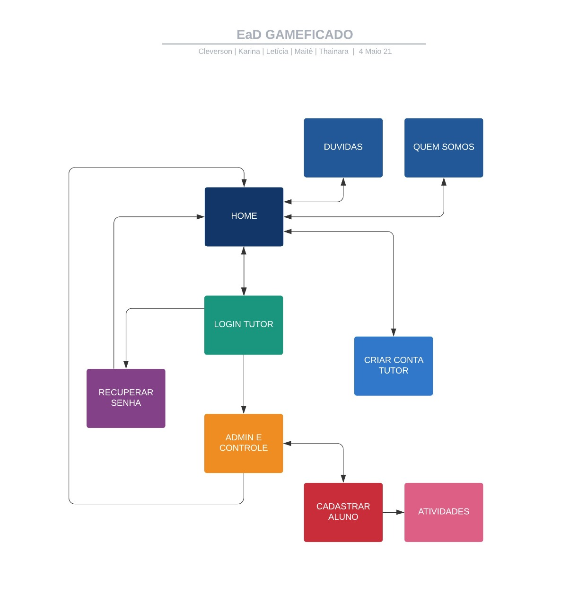

# Projeto de Interface

Embora houvessem diversas demandas relativas a interface adotada para o sistema, o foco principal para este caso tornou-se a usabilidade, as permissões, a interatividade e a acessibilidade do sistema e, para atender as necessidades dos usuários, adotou-se telas com padronização projetada para que seja possível o funcionamento do sistema em desktops e dispositivos móveis.

## User Flow

O diagrama relativo ao fluxo de interação do usuário pelas telas do sistema é mostrado na figura a seguir (algumas das telas gerais do sistema são apresentadas, de forma detalhada, na seção de Wireframes).

Figura 1 - Fluxo de telas de usuário

## Wireframes

São protótipos usados em design de interface para sugerir a estrutura de um site web e seu relacionamentos entre suas páginas. Um wireframe web é uma ilustração semelhante do layout de elementos fundamentais na interface.
 
> **Links Úteis**:
> - [Protótipos vs Wireframes](https://www.nngroup.com/videos/prototypes-vs-wireframes-ux-projects/)
> - [Ferramentas de Wireframes](https://rockcontent.com/blog/wireframes/)
> - [MarvelApp](https://marvelapp.com/developers/documentation/tutorials/)
> - [Figma](https://www.figma.com/)
> - [Adobe XD](https://www.adobe.com/br/products/xd.html#scroll)
> - [Axure](https://www.axure.com/edu) (Licença Educacional)
> - [InvisionApp](https://www.invisionapp.com/) (Licença Educacional)
