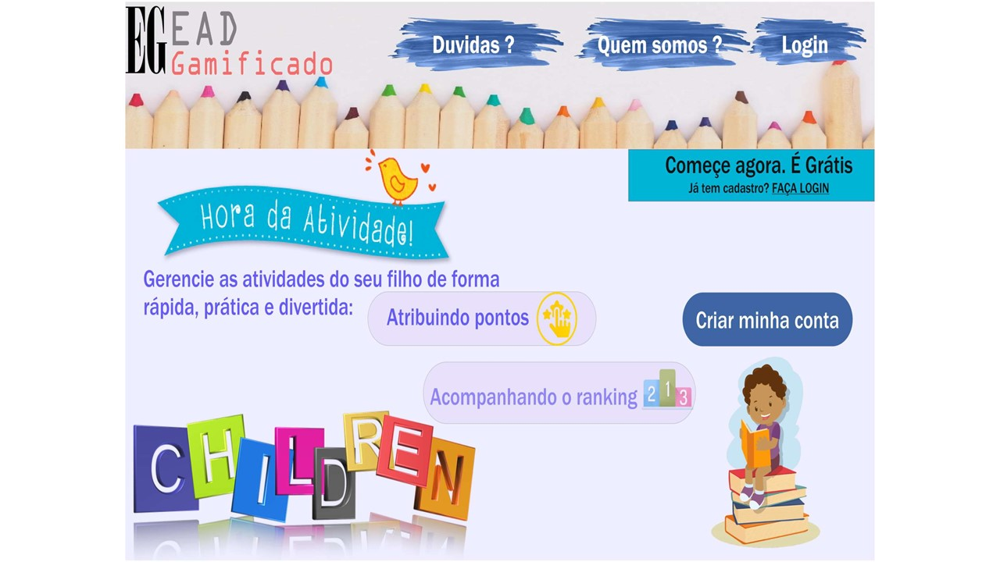
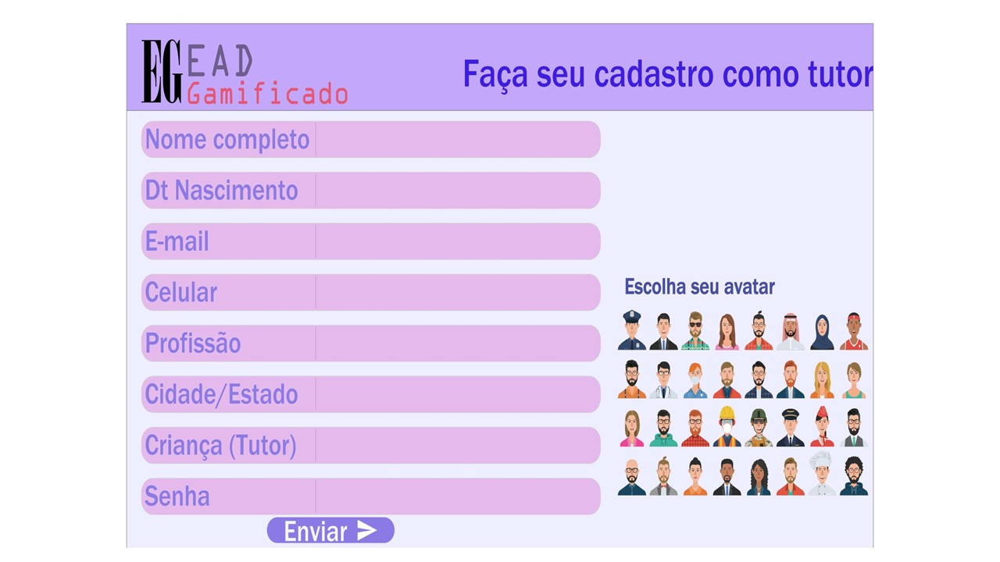

# Projeto de Interface

Embora houvessem diversas demandas relativas a interface adotada para o sistema, o foco principal para este caso tornou-se a usabilidade, as permissões, a interatividade e a acessibilidade do sistema e, para atender as necessidades dos usuários, adotou-se telas com padronização projetada para que seja possível o funcionamento do sistema em desktops e dispositivos móveis.

## User Flow

O diagrama relativo ao fluxo de interação do usuário pelas telas do sistema é mostrado na figura a seguir (algumas das telas gerais do sistema são apresentadas, de forma detalhada, na seção de Wireframes).

Figura 1 - Fluxo de telas de usuário

## Wireframes

Conforme a prioridade de telas para acesso, definida pelo fluxo presente na Figura 1, a seguir são apresentadas as telas principais. Todas as telas apresentadas possuem dois grandes blocos, descritos a seguir: 
* Cabeçalho - local em que consta a o logo do EaD  Gameficado e dados de definição da página, como, por exemplo, em home as coisas relativas a Home e em login o indicativo de que se está em uma página de login;
* Conteúdo - local visível em tela em que se é possível ver o conteúdo por ela aborado.

Figura 2 - Layout dos grandes blocos

São protótipos usados em design de interface para sugerir a estrutura de um site web e seu relacionamentos entre suas páginas. Um wireframe web é uma ilustração semelhante do layout de elementos fundamentais na interface.

### Tela de Home-Page

A tela de Home-Page mostra os destaques para quem ainda não tem cadastramento no site e disponibiliza a forma de acesso para quem já possui o login cadasrtrado. Ela é composta pelos seguintes elementos:
* Cabeçalho - Contendo a logo, a área de dúvidas, quem somos e a área para login;
* Área explicativa - Para fins de explicar superficialmente do que o site trata (como ao dizer para gerenciar as atividades dos filhos;
* Área de criação de conta - Permitindo acesso a outra página relativa a cadastramento no site.

Figura 3 - Tela de Home-Page

### Tela de Login

A tela de Login mostra os itens necessários para acesso ao sistema e disponibiliza dados para verificação do usuário quanto a onde se encotra no sistema. Os itens dessa página são:
* Cabeçalho - Contendo a logo e o nome do local no sistema em que o usuário se encontra;
* Área de login - Contendo pontos para o usuário preencher para conseguir acesso ao sistema;
* Área de Redefinição de senha - Permitindo acesso a outra página relativa a cadastramento de nova senha para conseguir acesso ao sistema em caso de esquecimento.

Figura 4 - Tela de Login

### Tela de Cadastramento do tutor
A tela de cadastramento do tutor mostra os itens necessários para ser realizado o cadastramento do Tutor que quer ter acesso ao sistema e disponibiliza dados para verificação do usuário quuanto a onde se encotra no sistema. Os itens dessa página são:
* Cabeçalho - Contendo a logo e o nome do local no sistema em que o usuário se encontra;
* Área de cadastramento do Tutor - Contendo pontos para o usuário preencher para conseguir se cadastrar no sistema;
* Área de escolha de avatar - Permitindo ao usuário a escolha de uma imagem na qual se sente representado.

Figura 5 - Tela de Cadastramento do Tutor

### Tela de Área do Tutor
A tela de Área do tutor mostra os itens necessários para que o tutor faça o controle de dados e cadastramentos de coisas voltadas ao aluno pelo qual é responsável. Os itens dessa página são:
* Cabeçalho - Contendo a logo e o nome do local no sistema em que o usuário se encontra;
* Área de Controle - Contendo pontos para o usuário Tutor(já cadastrado) cadastrar atividades para aluno pelo qual é responsável, montar ou liberar a participação do seu aluno no grupos de alunos, elaborar e checar cronogramas e avaliar atividades (para todas essas fucionalidades, há redirecionamento para outras páginas);
* Área de Checagem passiva - Permitindo acesso aos dados da evolução do usuário aluno de forma passiva.
* Chat - Permitindo conversação entre o Tutor e o aluno pelo qual é responsável.

Figura 6 - Tela de Área do Tutor

### Tela de Cadastramento do aluno
A tela de cadastramento do aluno mostra os itens necessários para ser realizado o cadastramento do aluno para o acesso ao sistema e disponibiliza dados para verificação do usuário quanto a onde se encotra no sistema. Os itens dessa página são:
* Cabeçalho - Contendo a logo e o nome do local no sistema em que o usuário se encontra;
* Área de cadastramento do Aluno - Contendo pontos para o usuário Tutor(já cadastrado) preencher para conseguir cadastrar o aluno no sistema;
* Área de escolha de avatar - Permitindo ao usuário a escolha de uma imagem na qual sente que o aluno pelo qual é responsável é representado.

Figura 7 - Tela de Cadastramento do Aluno

### Tela de Área do Aluno
A tela de Área do aluno mostra os itens necessários para que o aluno faça o controle de dados e de coisas voltadas as suas atividades escolares. Os itens dessa página são:
* Cabeçalho - Contendo a logo e o nome do local no sistema em que o aluno se encontra;
* Área de Controle - Contendo pontos para o usuário aluno(já cadastrado) ter acesso a sua evolução (para essa fucionalidade, há redirecionamento para outras páginas);
* Área de Checagem passiva - Permitindo acesso aos dados da evolução do usuário aluno de forma passiva.
* Chat - Permitindo conversação entre o Tutor e o aluno pelo qual é responsável.

Figura 8 - Tela de Área do Aluno
 
