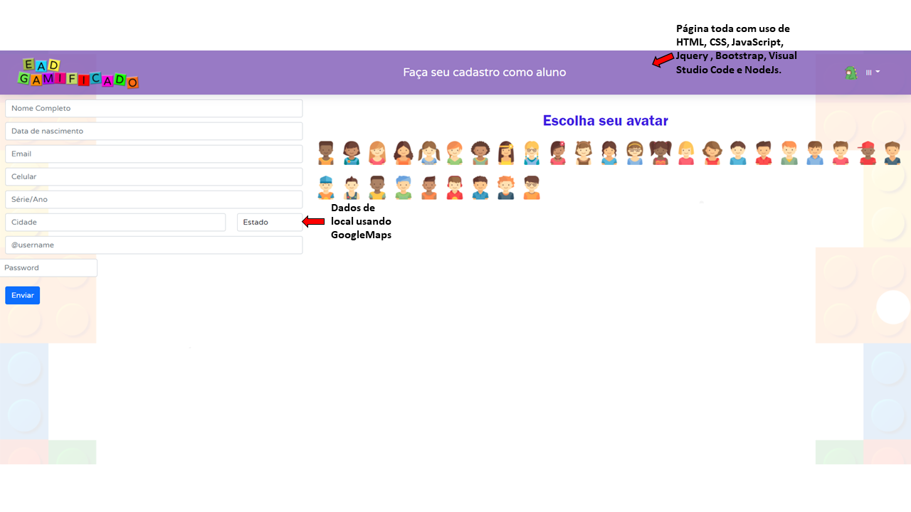

# Arquitetura da Solução

Os detalhes técnicos da solução criada para o EaD Gameficado, conforme os componentes que fazem parte da solução e do ambiente de hospedagem, são apresentados a seguir.

## Diagrama de componentes

Os componentes que fazem parte da solução são apresentados na Figura 9.

Figura 9 - Arquitetura da Solução

A solução implementada conta com os seguintes módulos:
- **Navegador** - Interface básica do sistema  
  - **Páginas Web** - Conjunto de arquivos HTML, CSS, JavaScript e imagens que implementam as funcionalidades do sistema.
   - **Local Storage** - armazenamento mantido no Navegador, onde são implementados bancos de dados baseados em JSON. São eles: 
     - **Matéria** - Seções de matérias que estiverem em uso (tanto em questões de edição quanto em questões de visualização por parte do usuário);
     - **Cronograma** - Cronograma com registros dos eventos;
     - **Atividades** - Atividades que estiverem sendo feitas por parte do aluno;
     - **Login** - Login de acesso do usuário. 
 - **APIs** - plataforma que permite acesso ao cadastramento de usuário, ao cadastramento de localização, interação por chat e demais funcionalidade do EaD Gameficado.
 - **Hospedagem** - local na Internet onde as páginas são mantidas e acessadas pelo navegador. 

A imagem a seguir ilustra o fluxo do usuário na solução, portanto, assim que o usuário entra na plataforma, ele é apresentado à tela inicial (Tela 1 - Home) onde é confrontado com as opões de ir para a página de dados como "Quem somos" e "Dúvidas", além da opção de fazer login e se cadastrar.
Caso ele opte por ir em "Quem somos" conseguirá ter acesso a dados de texto explicando sobre a plataforma EaD.
Se ele optar pelo caminho de "Dúvidas", terá a opção de cadastrar uma dúvida, colocando seu nome, sobrenome, selecionando sua atividade, e-mail e a dúvida em si.
Caso escolha o “Cadastrar Tutor”, terá acesso a uma página de cadastramento de tutor na qual deve inserir o nome completo, data de nascimento, e-mail, celular, profissão, cidade, Estado e definir se é tutor de algum aluno.
Caso ele opte pelo “Login”, deverá digitar os seus dados de Usuário e senha.
Quando logar ele terá a visão de acesso a duas seções, a de “Área do Tutor” e a de “Área do Aluno”, se ele escolher a “Área do Tutor” terá acesso a uma sessão que permite o cadastramento de alunos, de atividades, de grupo de alunos, o cadastramento de cronograma, a avaliação de atividades, o acompanhamento do desempenho de alunos cadastrados e um link para conversar com o aluno.
Caso ele opte pelo “Cadastro de Aluno”, será direcionado para uma página em que deve cadastrar o nome completo do aluno, a data de nascimento, o e-mail, o celular, a série, a cidade, o Estado, o username e o password.
Se ele escolher “Cadastrar Atividades” terá acesso a possibilidade de cadastrar atividades e recompensas de acordo com o nome do aluno, a matéria cursada, a atividade a ser feita, a avaliação, a localização no mapa, a data de entrega prevista e pode, também, excluir atividades ou editá-las.
Caso opte por “Grupo de Alunos” terá a possibilidade de acessar o chat para conversar com um grupo de alunos.
Caso venha a optar por “Cronograma”, poderá cadastrar as datas de entrega e qualquer outra particularidade relacionada a sua função como Tutor.
Se escolher “Avaliar atividades, terá como escolher se as respostas dadas pelo aluno estão conforme o que era o esperado, marcando-a como correta ou incorreta.
Caso escolha o link do chat de bate-papo, será direcionado para o Whatsapp para conversar com a criança pela qual é responsável.
Se o usuário optar, ao invés da tela da “Área do Tutor”, pela “Área do aluno”, ele será direcionado a tela do aluno, lá ele poderá ver o seu progresso como aluno em cada matéria, consultar o ranking de alunos e seus progressos, acessar o botão “Estudar” e o botão do chat por Whatsapp.
Caso o usuário selecione o botão estudar, será direcionado para uma tela em que constam mapas de matérias tipo trilha, nos quais poderá realizar atividades até chegar até as suas premiaçãos (conforme cadastramento feito pelo tutor).
Se ele optar por acesso ao botão de chat por Whatsapp, será direcionado para uma conversa com o seu Tutor responsável.
Há ainda uma opção para caso o usuário queira cadastrar um usuário, no qual ele seleciona o link de “Cadastrar Tutor”.

Figura 11 – Fluxo de Usuário

## Tecnologias Utilizadas

Para desenvolver as soluções as apresentadas no projeto serão usados o Css, o Html, o JavaScript o Bootstrap, o GoogleCharts, o Jquery, o Whatsapp e o GoogleMaps, além das soluções oferecidas pelo NodeJs e o Visual Studio Code.
A seguir, na Figura 11 e 12, são apresentadas imagens nas quais se pode exemplificar em quais pontos do site serão aplicadas as tecnologias para as soluções.

Figura 11 – Exemplo 1 de pontos da solução oferecida

Figura 12 – Exemplo 2 de pontos da solução oferecida

## Hospedagem

A hospedagem será implementada através da publicação do site no Heroku.
