# Template padrão do site

# Template padrão do site

Para padrão de Layout, foi adotado o previsto no projeto de interface, elaborado na seção 3, contendo um cabeçalho e o conteúdo, conforme visto na figura 13 a seguir.
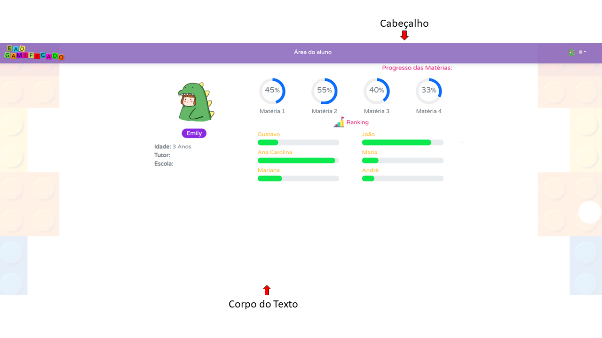

Figura 13 – Exemplo de Padrão e Layout

O template criado é composto pelas seguintes telas:
* Tela de Home;
* Quem somos;
* Dúvidas;
* Cadastro de Usuário;
* Tela de Login;
* Tela de Cadastro de Aluno;
* Tela de Área do Tutor;
* Tela de Grupo de Alunos;
* Tela de Cadastro de Atividades;
* Tela de Cronograma;
* Tela de Área do Aluno;
* Tela de Trilha;
* Tela de Avaliação do Aluno.

A responsividade segue o padrão do Bootstrap.

# Tela de Home

Tela que abrange a visualização inicial do site e os links para “Quem somos”, “Dúvidas”, “Login” e “Cadastro”.

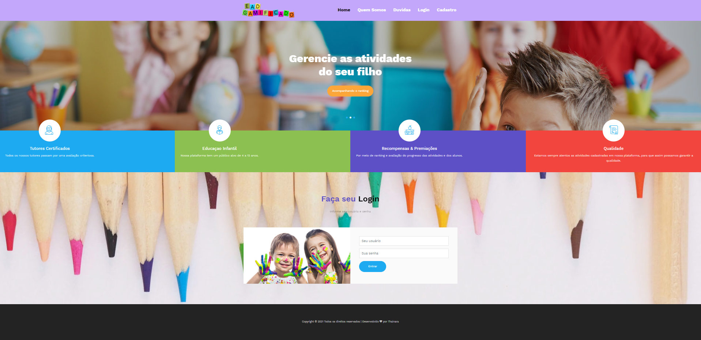

Figura 14 – Tela de Home

# Quem Somos

Tela contendo explicações sobre a funcionalidade e utilidade do EaD Gameficado.

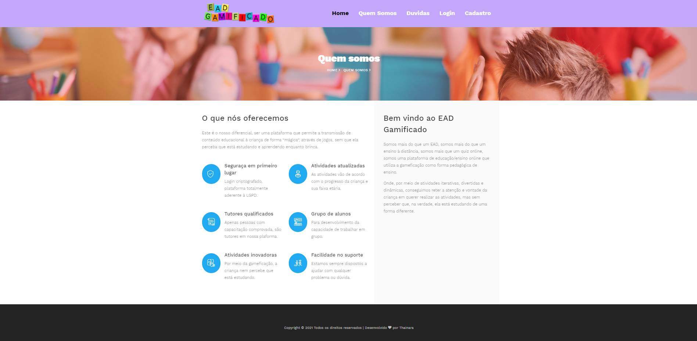

Figura 15 – Tela de Quem Somos

# Dúvidas

Tela contendo local para cadastramento de dúvidas.

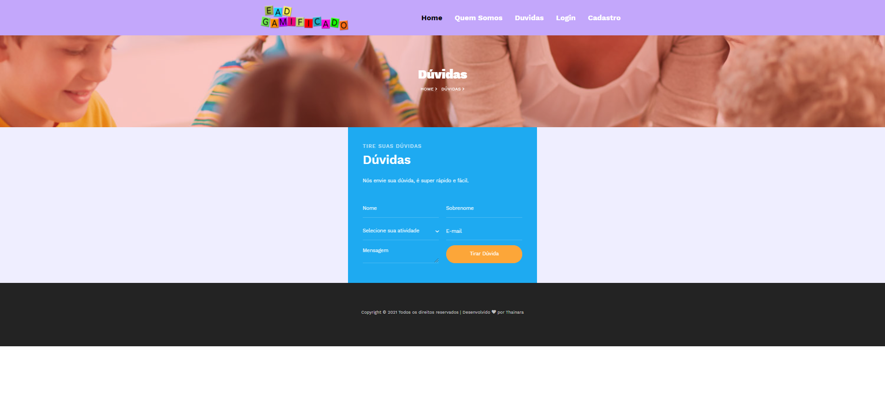

Figura 16 – Tela de Dúvidas

# Tela de Cadastro de Usuário

Tela contendo pontos para cadastramento de tutor.

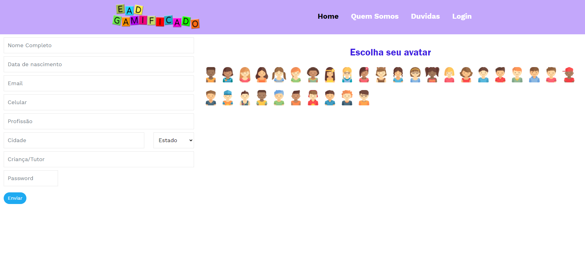

Figura 17 – Tela de Cadastro de Tutor

# Tela de Login

Tela contendo pontos para permissão de login em sistema.

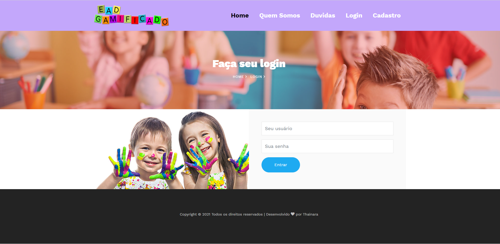

Figura 18 – Tela de Login

# Tela de Cadastro de Aluno

Tela contendo pontos para cadastramento de Aluno.

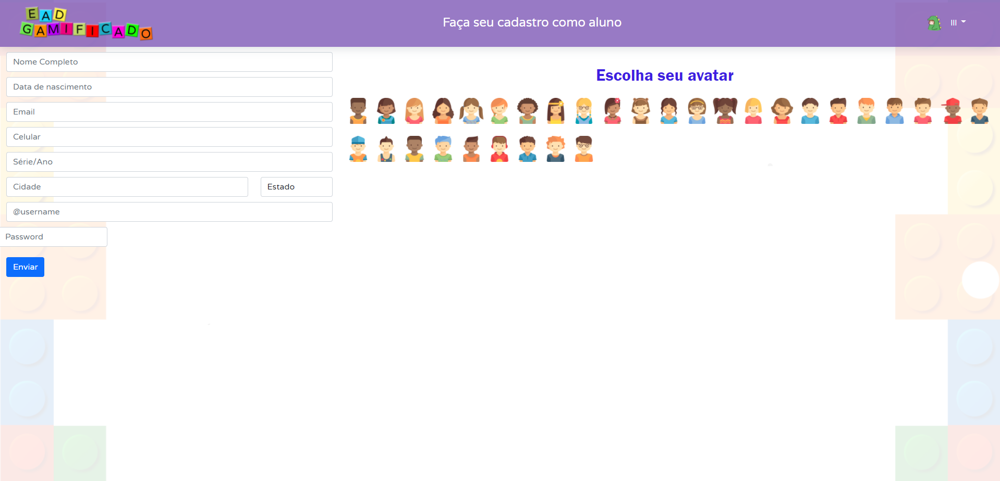

Figura 19 – Tela de Cadastro de Aluno

# Tela de Área do Tutor

Tela contendo progresso de alunos, desempenho em matérias que o tutor cadastrar e botões para ações junto ao Aluno.

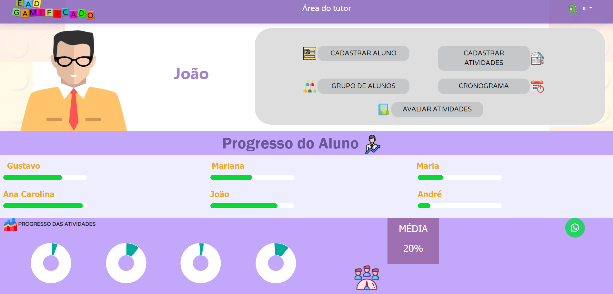

Figura 20 – Tela de Área do Tutor

# Tela de Grupo de Alunos

Tela contendo Chat para conversação entre alunos.

# Tela de Cadastro de Atividades

Tela contendo pontos para cadastramento de atividades e premiações.

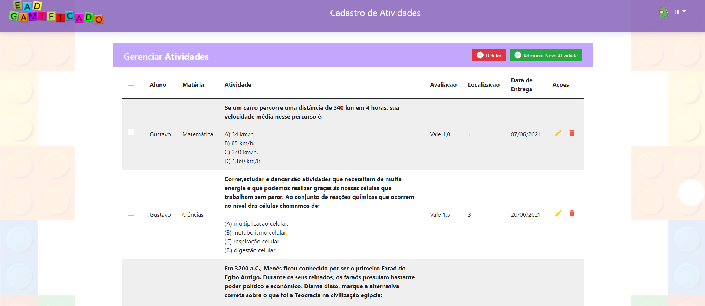

Figura 21 – Tela de Cadastramento de Atividades

# Tela de Cronograma

Tela com calendário para cadastramento de atividades e premiações em uma linha do tempo.

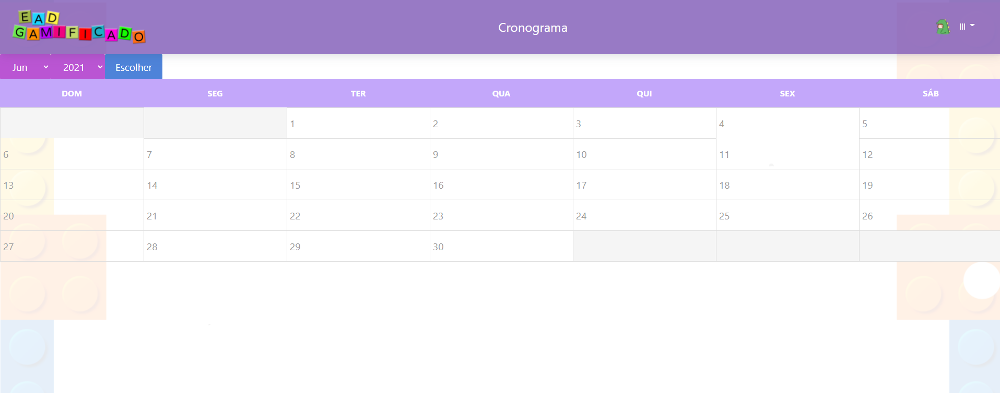

Figura 22 – Tela de Cronograma

# Tela de Área do Aluno

Tela contendo progresso do aluno, ranking e botões para ação de estudar.

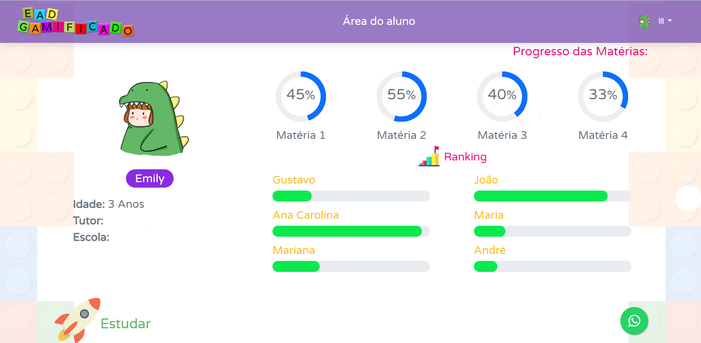

Figura 23 – Tela de Área do Aluno

# Tela de Trilha

Tela contendo trilha com atividades feitas e a serem feitas.

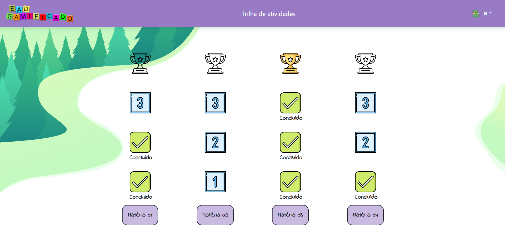

Figura 24 – Tela de Estudos tipo Trilha

# Tela de Avaliação do Aluno

Tela contendo meios de validar a avaliação do aluno em uma atividade.

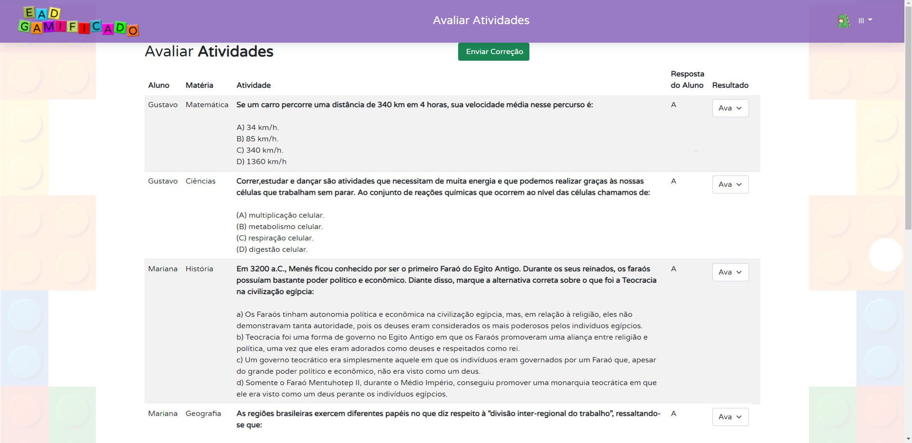

Figura 25 – Tela de Avaliação Atividades

