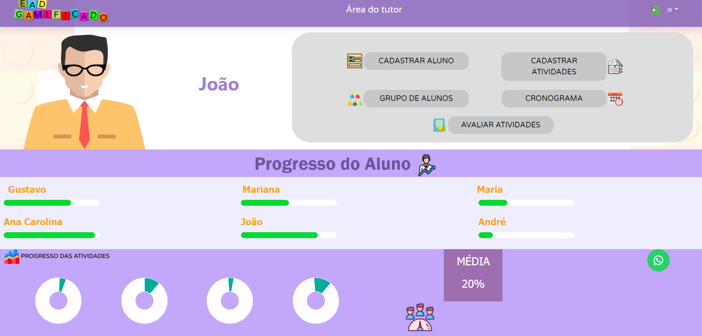
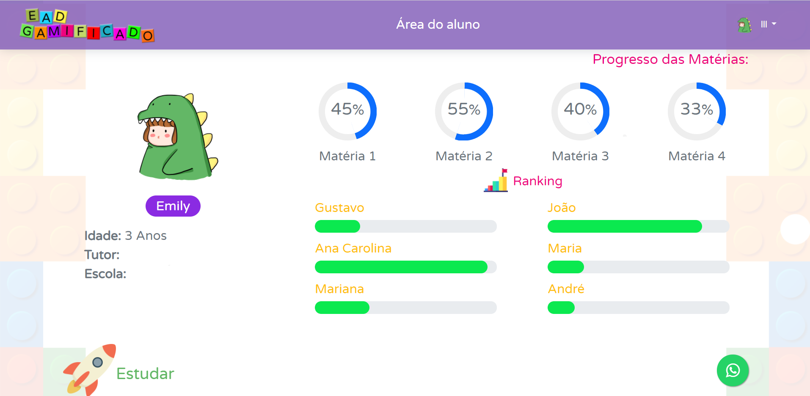
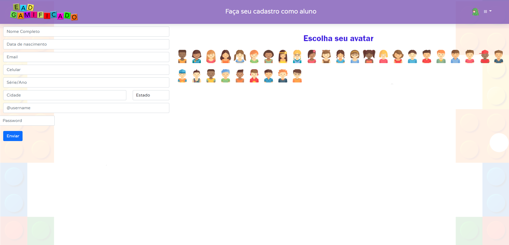
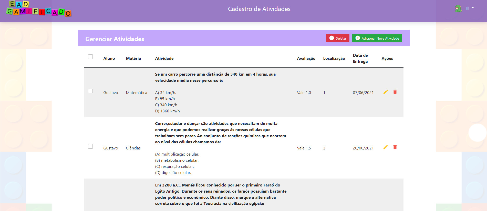
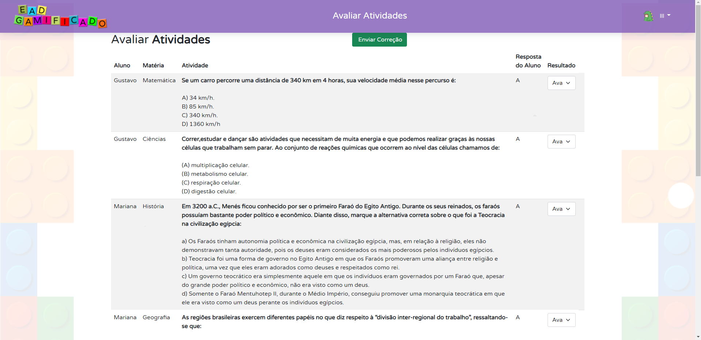

# Programação de Funcionalidades
São apresentadas a seguir as funcionalidades do sistema que eram previstas nos requisitos e que foram atendidas pelos artefatos criados (código fonte) e as instruções para acesso e verificação da implementação.

## Cadastrar e gerenciar responsáveis – (RF-001 e RF-003)

A tela de cadastramento de Tutor(que também é o responsável) apresenta meios de cadastrar o tutor e a tela de área do tutor permite a edição de alguns dos dados do tutor.

Figura 25 – Tela de Cadastro de Tutor

Figura 26 – Tela de Área do Tutor

### Requisitos atentidos

RF-001 - Cadastrar e gerenciar responsáveis
RF-003 - Cadastrar e gerenciar tutores

### Artefatos da Funcionalidade 

### Estrutura de dados

### Instruções de Acesso

* 1 - Abra o navegador e informe o endereço da página;
* 2 - Na barra de navegação, clique em cadastro;
* 3 - Preencha os dados de cadastro e crie um cadastro de tutor.

##	Cadastrar e gerenciar crianças – (RF-002, RF-004, RF-005, RF-006, RF-007, RF-008, RF-009, RF-010 )

A tela de cadastramento de Criança apresenta meios de cadastrar dados da criança e a tela de Área do tutor permite o gerenciamento do aluno (figura de área do tutor apresentada anteriormente, sendo ela a Figura 26) atualizando suas atividades, notas, ranking, pontuação, premiação e chat, sendo todas as funcionalidades classes que ficam dentro da área do tutor, mas com página prórpria, como apresentado a seguir.

Figura 27 – Tela de Área do Aluno

Figura 28 – Tela de Cadastro de Aluno

Figura 29 – Tela de Cadastramento de Atividades

Figura 30 – Tela de Cronograma

Figura 25 – Tela de Avaliação Atividades

### Requisitos atentidos

RF-002	Cadastrar e gerenciar crianças
RF-004	Cadastrar e gerenciar tarefas
RF-005	Cadastrar e gerenciar premiações
RF-006	Cadastrar e gerenciar cronograma de estudo
RF-007	Cadastrar e gerenciar grupos e ranking
RF-008	Efetuar avaliações e pontuações
RF-009	Visualizar resultado individual e total
RF-010	Conversar via chat ao vivo

### Artefatos da Funcionalidade 

### Estrutura de dados

### Instruções de Acesso

* 1 - Se não for cadastrado, siga os passos de cadastramento do tutor, se já for cadastrado, logue na plataforma;
* 2 -  Entre a Área do Tutor;
* 3 - Se não for cadastrado, clique no botão e cadastre um novo Aluno, preencha os dados e os registre;
* 3 - Na Área do Tutor, clique na opção desejada para gerenciar algum tipo de atividade relacionada ao aluno;
* 3 - Preencha os dados de cadastro dentro da área em questão e os salve.
